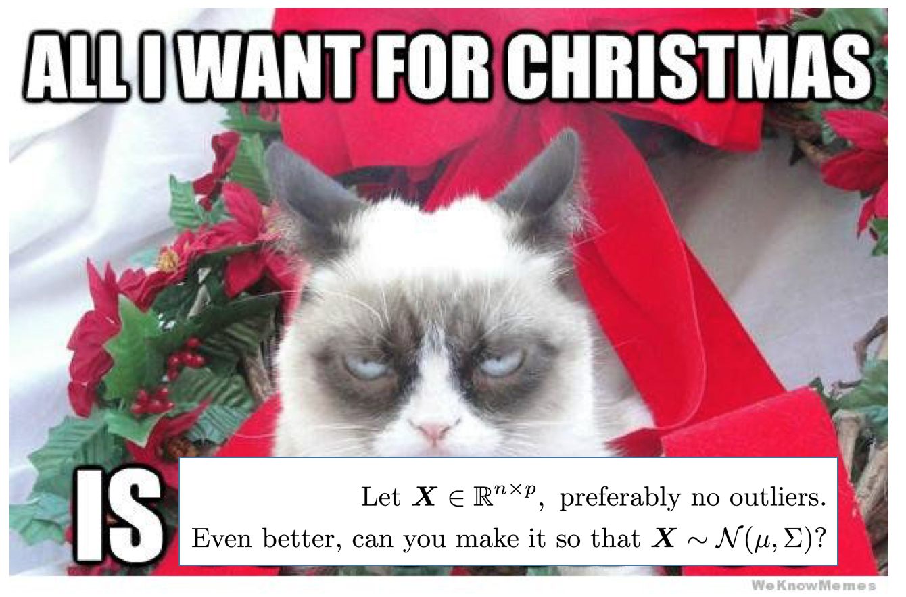
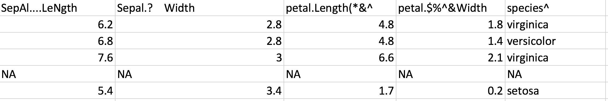
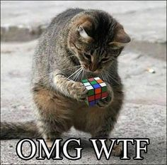
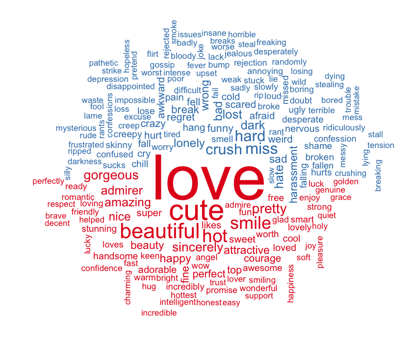

```{r setup, include=FALSE}
library(knitr)
library(tidyverse)
library(plotly)
opts_chunk$set(comment=NA, warning=FALSE, message=FALSE)


options(tibble.print_max = 10, tibble.print_min = 5)
# library(visNetwork)
```


<style>
slides > slide { overflow: scroll; }
slides > slide:not(.nobackground):after {
  content: '';
}
</style>

# S0: Prior to lecture

```{r constructDirtyIris, eval = F, echo = F}
set.seed(10)
dirtyIris = as.tbl(iris)
dirtyIris = dirtyIris %>% 
  add_row(Sepal.Length = sample(c(rnorm(1),NA), 100,replace = T), 
          Sepal.Width = rep(NA, 100),
          Petal.Length = rep(NA, 100),
          Petal.Width = rep(NA, 100),
          Species = rep(NA, 100)) %>% 
  cbind(allEmpty = NA) %>% 
  sample_n(size = nrow(.))

colnames(dirtyIris)[1:5] = c("SepAl....LeNgth", "Sepal.?    Width", "petal.Length(*&^",
                        "petal.$#^&Width", "SPECIES^")

dirtyIris

write_csv(dirtyIris, path = "dirtyIris.csv")
```

## Preparing for this lecture {.build}

+ All materials are on: https://github.com/kevinwang09/2017_STAT3914

<!-- + Go and download this file: https://github.com/kevinwang09/2017_STAT3914/dirtyIris_excel.xlsx -->
+ Please run these codes on your laptop,

```{r, eval = F}
## Might be a while...
install.packages(c("ggplot2","dplyr","tidyr","janitor","plotly",
                   "devtools","learnr","gapminder")) 

library(devtools)
install_github("kevinwang09/2017_STAT3914", subdir = "learnr3914")
```

+ Familiar yourself with the `iris` dataset. Typing `iris` into `R` console should load this data. Pay attention to its column, row names and structure of each column. 


#####################################################
# S1: Necessary of Applied Statistics
## Good statistical discoveries don't fall out from the sky {.build}

+ Statisticians are great at many things:

    1.  Understanding data characteristics
    1.  Building statistical/mathematical models
    1.  Repeat 1 and 2...like...a lot...
    1.  Extract insights

+ But the mother of all these, i.e. **preparing data** is not trivial. (e.g. STAT2xxx lab exams)

## Let $\boldsymbol{X}$ be the thing I want... {.build}

+ The real problem is not applying fancy shampoo for your cat. It is getting your cat into the bathtub.

<center>  </center>


## Hidden side of being a statistician {.build}

<center>  </center>

+ Assume we have data
+ Assume we have questions, which the data can be used to answer
+ Assume we have cleaned data
+ Assume we interrogated the right aspects of the data using appropriate statistics
+ Assume we did everything right, communicate insights with others


## Summary of this lecture {.build}

+ Powerful tools for data preparation.
+ Passive learning is not going to work.
+ Our goal: clean the `dirtyIris` data to be exactly the same as the original `iris` data.

<center>  </center>

+ S1: Introduction
+ S2: Reading in data using `readr` and `readxl`
+ S3: Basic data cleaning using `janitor`
+ S4: Clean coding using `magrittr`
+ S5: Data filtering using `dplyr`
+ S6: Data visualisation using `ggplot2`
+ S7: Conclusion


#####################################################
# S2: Reading data
## Better read/write data {.build}

+ `base` R functions are not sufficient for modern uses.

+ `readr` functions are superior in data import warnings, column type handling, speed, scalability and consistency.

```{r loading readr}
library(readr)
```


## Reading data using *readr* (1){.build}

```{r read_csv, message = T}
dirtyIris = readr::read_csv("dirtyIris.csv")
class(dirtyIris) ## `tibble` is a `data.frame` with better formatting.
```
+ `readxl` and `haven` (for SAS, SPSS etc) packages work similarly. 


## Reading data using *readr* (2){.build}

```{r dirtyIrisLook}
dirtyIris
```
<center>  </center>

+ We now proceed to data cleaning on the `dirtyIris` dataset. 

## Too trivial? Here is a short homework {.build}

Here is a dataset. [Click here.](https://github.com/kevinwang09/2017_STAT3914/blob/master/h.all.v6.0.symbols.gmt)

1.  Write 2 sentences about what is a `.gmt` file and who publishes this format?
1.  Which packages can read in `.gmt` files?
1.  How to download this package?
1.  What class is this data once read into `R`? Is it a `data.frame`?
1.  The data contains 50 different gene-sets. What is the size of each gene-set?
1.  What is the mostly frequent mentioned 6 genes?

```{r, eval = F, echo = F}
library(qusage)
gs = read.gmt("h.all.v6.0.symbols.gmt")
genes = gs %>% unlist
genes %>% table %>% sort %>% tail
```


# S3: Cleaned data
## What is clean data? {.build}

**Clean data is a data set that allows you to do statistical modelling without extra processing**

  1.  Good documentation on the entire data.
  1.  Each column is a **variable**. The name should be informative, and:
    - No bad characters/formatting [\@KevinWang009](https://twitter.com/KevinWang009)
    - No inconsistent capitalisation or separators (`Cricket_australia` vs `cricket.Australia`)
  1.  Each row is an **observation**:
    - No bad characters
    - No poorly designed row names (3, 2, 5, ... )
    - No repeated row names (a, a.1, b, b.1, ... )


## Data cleaning in *R*

+ Clean data is a well-designed `data.frame`.

+ Column type (esp. dates and factors) handling was the primary reason we used `readr` instead of `base` R when importing data.

+ Our goal: clean the `dirtyIris` data to be exactly the same as the original `iris` data.

    - Basic data cleaning using `janitor` package.
    - More advanced data manipulation through `dplyr`.


## *janitor*: basic data cleaning {.build}

+ Clean up the bad column names

```{r janitor1}
library(janitor)
glimpse(dirtyIris)
## Clean up column names
better = clean_names(dirtyIris) 
glimpse(better)
```

## *janitor*: removal of missing values {.build}

+ Purely empty rows/columns are non-informative.

```{r janitor2}
## Removing empty rows/columns
evenBetter = remove_empty_rows(better)
evenBetter = remove_empty_cols(evenBetter)

glimpse(evenBetter)
```

+ Genuinely missing values should be retained, but in this case, the NA's were added.

+ Removing any rows with NA
```{r janitor3}
evenBetterBetter = remove_missing(evenBetter) 
cleanIris = evenBetterBetter
```

+ We now have agreement over the size of the two data
```{r janitor4}
glimpse(cleanIris)
glimpse(iris)
```


<!-- ## *janitor* also has some good tabulate functions (optional) {.build} -->

<!-- ```{r janitor3} -->
<!-- ## Equivalent to: -->
<!-- # table(evenBetter$employee_status) -->
<!-- # prop.table(table(evenBetter$employee_status)) -->

<!-- tabyl(evenBetter$employee_status) -->


<!-- ## Equivalent to: -->
<!-- # with(evenBetter, -->
<!-- #      table(employee_status, full_time)) -->

<!-- crosstab(.data = evenBetter, -->
<!--          employee_status, full_time) -->
<!-- ``` -->


#########################################
# S4: Clean coding (skim through)
## Coding complexity increases with the number of brackets {.build}

+ The "inside out" structure of coding isn't great for human reading.

```{r nestedBrackets, fig.width=4, fig.height=4}
mean(cleanIris$sepal_length)
plot(density(cleanIris$sepal_length), col = "red", lwd = 2)
```


## Piping: read code from left to right  {.build}

+ We introduce a new notation: " x %>% f " means "f(x)". We call this operation as "x pipe f".

+ Compounded operations are possible. Keyboard shortcut is Cmd+shift+M.

```{r piping, fig.width=4, fig.height=4}
cleanIris$sepal_length %>% mean

cleanIris$sepal_length %>%
  density %>%
  plot(col = "red", lwd = 2)
```


# S5: `dplyr`: data subsetting master
## Traditional way of subsetting data in R (1) {.build}

+ If I want the first two rows of column `sepal_length` and `sepal_width` in the `cleanIris` data:

```{r basicSubsetting, eval = F}
## Assuming you know the position of column names.
## But what if you resample your data?
cleanIris[1:2, c(1, 2)]

## Assuming you know the position of column names.
## Also assuming the first two columns satisfy certain properties.
cleanIris[1:2, c(T, T, F, F, F)]

## Much better!
## What if you can't type out all the column names
## due to the size of your data?
cleanIris[1:2, c("sepal_length", "sepal_width")]
```


## Traditional way of subsetting data in R (2) {.build}
+ Something more realistic: we want to extract rows based on some compounded criteria and select columns based on special keywords.

```{r BasicSubsetting2}
cleanIris[(cleanIris[,"sepal_length"] < 5) &
            (cleanIris[,"sepal_width"] < 3), c("petal_length", "sepal_length")]
```


+ (Optional) A pro `R` user might know about the `subset` function, but it suffers the same problem of not able to have multiple subsetting criteria without predefined variables.

```{r BasicSubsetting3}
subset(cleanIris,
       subset = (sepal_length < 5) & (sepal_width < 3),
       select = grep("length", colnames(cleanIris), value = TRUE))
```


## Subsetting data using *dplyr* {.build}

+ Think of subsetting rows and columns as two **separate different procedures**:
  - `select` columns are operations on variables, and 
  - `filter` rows are operations on observations

+ See [dplyr cheatsheet](https://www.rstudio.com/wp-content/uploads/2015/02/data-wrangling-cheatsheet.pdf).

```{r dplyr1}
library(dplyr)

cleanIris %>%
  filter(sepal_length < 5,
         sepal_width < 3) %>%
  select(contains("length"))
```


## *dplyr* is much more!  {.build}

+ `mutate` creates new columns

```{r mutate}
iris_mutated = mutate(cleanIris,
      newVar = sepal_length + petal_length,
      newNewVar = newVar*2)

iris_mutated
```

+ `group_by` + `summarise` will create summary statistics for grouped variables

```{r summarise}
bySpecies = cleanIris %>%
  group_by(species)

bySpecies

bySpecies %>%
  summarise(meanSepalLength = mean(sepal_length))
```

+ `left_join` for merging data

```{r left_join}
flowers = data.frame(species = c("setosa", "versicolor", "virginica"),
                     comments = c("meh", "kinda_okay", "love_it!"))

## cleanIris has the priority in this join operation
iris_comments = left_join(cleanIris, flowers, by = "species")

## Randomly sampling 6 rows 
sample_n(iris_comments, 6) 
```

## Checking if we cleaned the data properly {.build}

+ `arrange` for ordering rows

```{r arrange}
arrangeCleanIris = cleanIris %>% 
  arrange(sepal_length, sepal_width, petal_length, petal_width)

## The true iris data
arrangeIris = iris %>% 
  clean_names() %>% 
  arrange(sepal_length, sepal_width, petal_length, petal_width)
```

+ We sorted both the processed `dirtyIris` data and the arranged `iris` data. 

```{r allequal}
## The `Species` column is character or factor
all.equal(arrangeCleanIris, arrangeIris) 

arrangeIris = arrangeIris %>% 
  mutate(species = as.character(species)) 

## Great! 
all.equal(arrangeCleanIris, arrangeIris)
```


```{r identical}
## identical is stronger version of all.equal
## arrangeCleanIris is a tibble
## but arrangeIris is a data.frame
identical(arrangeCleanIris, arrangeIris) 
class(arrangeCleanIris)
class(arrangeIris)

## Now, they are exactly the same!
identical(arrangeCleanIris, arrangeIris %>% as.tibble)
```


## *dplyr* special select functions (advanced) {.build}

+ select only if certain string is present

```{r selectWith}
cleanIris %>% 
  select(ends_with("length"))

cleanIris %>% 
  select(starts_with("sepal"))
```

+ select only if a column satisfy a certain condition

```{r summariseIf}
bySpecies %>%
  summarise_if(is.numeric,
               funs(m = mean))
```

# S6: `ggplot2`: the best visualisation package
## *ggplot2* tutorial sheet {.build}

+ If you managed to install all packages successfully, you should be able to run the following to get an interactive tutorial sheet. 

```{r, eval = F}
library(learnr3914)
learnggplot2()
```

+ Otherwise, please download and compile the "ggplot2_basic_tutorial.Rmd"  [here](https://github.com/kevinwang09/2017_STAT3914/blob/master/ggplot2_basic_tutorial.zip)

+ If all fails, please send me an email at kevin.wang@sydney.edu.au.


## *ggplot2*: the philosophy {.build}

+ Di Cook - the real reason that you should use `ggplot2` is that, its design will force you to use a certain **grammar** when producing a plot. So much so, every plot you produce is actually a statistic. 

```{r ggplotp1}
library(ggplot2)
p1 =
  iris %>%
  ggplot(aes(x = Sepal.Length,
             y = Sepal.Width,
             colour = Species)) +
  geom_point(size = 3)

p1 
```


# S7: Conclusion

## tidy data, coding, modelling and reporting {.build}

+ `tidyverse` is a collection of 20+ packages built on the philosophy of being organised for the purpose of collaboration. 

+ These functions:
    - They integrate against each other well.
    - They are NOT ad-hoc programming solutions.
    - They will always throw errors at you if you don't have a thorough understanding of your data.

## A gallery (optional) {.build}

+ Interactive plotting from ggplot

```{r ggplotly, fig.width=8, fig.height=8}
plotly::ggplotly(p1)
```

+ A lot of new and powerful packages are being developed.

<center></center>


+ Preview of next lecture: data visualisation on `gapminder`. http://edinbr.org/edinbr/2016/05/11/may-Hadley-Update2-PostingTalk.html

```{r, eval = F}
library(gapminder)
library(dplyr)
library(purrr)
library(tidyr)
library(broom)
library(ggplot2)

gapminder <- gapminder %>% mutate(year1950 = year - 1950)

by_country <- gapminder %>%
        group_by(continent, country) %>%
        nest()

country_model <- function(df) {
        lm(lifeExp ~ year1950, data = df)
}

models <- by_country %>%
        mutate(
                model = data %>% map(country_model)
        )

models <- models %>%
        mutate(
                glance  = model %>% map(broom::glance),
                rsq     = glance %>% map_dbl("r.squared"),
                tidy    = model %>% map (broom::tidy),
                augment = model %>% map (broom::augment)
        )

models %>%
        unnest(tidy) %>%
        select(continent, country, term, estimate, rsq) %>%
        spread(term, estimate) %>%
        ggplot(aes(`(Intercept)`, year1950)) +
                geom_point(aes(colour = continent, size = rsq)) +
                geom_smooth(se = FALSE) + 
                xlab("Life Expectancy in 1950") +
                ylab("Linear yearly improvement") + 
                ggtitle("LM on life exp. explained by time elapsed from 1950") +
                scale_size_area(expression(R^2)) +
                theme(legend.position = "bottom")
```


<!--   -   e.g. reproducible cross validation in 7 lines. I wrote this in the worst notation possible on purpose. You shouldn't use this when doing your assignments. -->

<!-- ```{r modelr} -->
<!-- subIris = iris[1:100,] -->
<!-- subIris$Species = as.integer(subIris$Species) - 1L -->

<!-- set.seed(8913) -->
<!-- cvDf = tibble(expNum = paste0("Exp", 1:100), -->
<!--               folds = map(expNum, -->
<!--                           ~ modelr::crossv_kfold(subIris, k = 5))) %>% -->
<!--   unnest -->


<!-- modelIris = mutate(cvDf, -->
<!--                    glms = map(train, -->
<!--                               ~ glm(Species ~ Sepal.Length, data = .x, -->
<!--                                     family = "binomial"))) -->

<!-- fitIris = mutate(modelIris, -->
<!--                  fitProb = map2(glms, -->
<!--                                 test, -->
<!--                                 ~ predict.glm(object = .x, -->
<!--                                              newdata = .y, -->
<!--                                              "response")), -->
<!--                  fitClass = map(fitProb, -->
<!--                                   ~ (.x > 0.5) + 0L), -->
<!--                  testClass = map(test, ~ as.data.frame(.x)$Species), -->
<!--                  missClass = map2_dbl(testClass, -->
<!--                                       fitClass, -->
<!--                                       ~ sum(.x != .y)) -->
<!--                  ) -->

<!-- fitIris %>% print(width = Inf) -->

<!-- fitIris %>% -->
<!--   group_by(expNum) %>% -->
<!--   summarise(meanMissClass = mean(missClass)) %>% -->
<!--   dplyr::select(meanMissClass) %>% -->
<!--   ggplot(aes(x = 1, -->
<!--              y = meanMissClass)) + -->
<!--   geom_boxplot(width = 0.15, -->
<!--                lwd = 1, -->
<!--                fatten = 1.5, -->
<!--                alpha = 0, -->
<!--                colour = "black") + -->
<!--   geom_violin(trim = F, -->
<!--               alpha = 0, -->
<!--               lwd = 1.3, -->
<!--               colour = "#663300") + -->
<!--   geom_jitter(size = 2, -->
<!--               width = 0.03, -->
<!--               colour = "red") + -->
<!--   theme_bw() + -->
<!--   ggtitle("Mean Miss-classifications in each iteration") -->
<!-- ``` -->


<!-- ```{r, eval = F, echo = F} -->
<!-- library(ggimage) ## Extension of ggplot2 geoms -->
<!-- library(gganimate) ## Make a series of ggplots into a GIF -->

<!-- set.seed(10) -->

<!-- df = tibble(time = 1:10) %>% -->
<!--   mutate(x = map(.x = time, -->
<!--                  .f = ~ rnorm(.x)), -->
<!--          y = map(.x = time, -->
<!--                  .f = ~ rnorm(.x))) -->

<!-- df = df %>% unnest -->


<!-- p = ggplot(df, aes(x = x, -->
<!--                y = y, -->
<!--                frame = time)) + -->
<!--   geom_pokemon(aes(image = "pikachu")) + -->
<!--   ggtitle("I have no idea what is going on") + -->
<!--   theme_bw() -->

<!-- gganimate(p, filename = "pikachu.gif") -->
<!-- ``` -->

## Advice in the future {.build}

+ Use RStudio + RMarkdown to document your codes.

+ Learn some computational tools. They are not statistics, but not learning them could inhibit your career aspects.

+ Find "cool" components and adapt those into your work routine. (Hint: start with [all RStudio cheatsheets](https://www.rstudio.com/resources/cheatsheets/) and build up gradually.)

+ Take time to re-analyse an old dataset. 

+ Learn core functions and vignette.

+ Don't forget the theories and interpretations! This is a course about statistics after all, not Cranking-Out-Numbers-Less-Than-0.05-And-Reject-Null-Hypothesis-101.

## Session Info and References {.build}

- Dr. Garth Tarr
- tidyverse.org
- github.com/sfirke/janitor
- gapminder.org
- rstudio.com


```{r}
sessionInfo()
```

