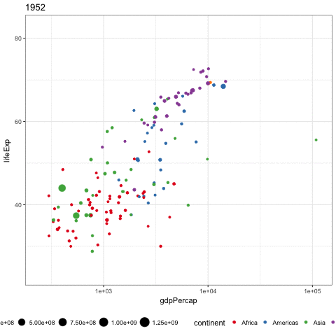

```{r setup, include=FALSE}
library(ggplot2)
library(dplyr)
library(learnr)
library(gapminder)
library(RColorBrewer)
library(ggthemes)
library(tidyr)
library(ggrepel)
library(gganimate)
library(plotly)


knitr::opts_chunk$set(echo = T)
tutorial_options(exercise.eval = FALSE)
```


```{r, echo = F}
options(tutorial.storage = list(

  # save an arbitrary R object "data" to storage
  save_object = function(tutorial_id, tutorial_version, user_id, object_id, data) {
  
  },
  
  # retreive a single R object from storage
  get_object = function(tutorial_id, tutorial_version, user_id, object_id) { 
    NULL 
  },
  
  # retreive a list of all R objects stored
  get_objects = function(tutorial_id, tutorial_version, user_id) { 
    list() 
  },
  
  # remove all stored R objects
  remove_all_objects = function(tutorial_id, tutorial_version, user_id) {
  
  }
))
```


## `ggplot2` introduction

+ `ggplot2` is a powerful data visualisation package in `R`.
+ The "gg" stands for "grammar of graphics", which means, the codes that is producing the plots has sophisticated and rigourous logic behind it. 

+ (From Professor Di Cook) One most important idea behind `ggplot2::ggplot` is that you should think about each plot as a statistic: it is a transformation of your data. It is built to be informative. It is built to communicate insights.  

+ When you are going through this tutorial, I encourage you to challenge every plot I made. Ask the question if these plots can be improve in some ways to better communicate ideas and insights in the data.  


## Building up your first `ggplot`

### Blank ggplot

+ `ggplot2::ggplot()` must interact with a `data.frame`.

+ Run the code below. You should see a blank grey plot.

```{r blankggplot, exercise = T}
ggplot(iris)
```


### Adding aesthetics to ggplot

+ The reason that we got a blank plot is because we didn't tell `ggplot` what we want to see on this plot.

+ We know that there is a column call `Sepal.Length` and `Sepal.Width` in the `iris` data.frame, so let's use these as `x` and `y` aesthetics.

```{r addingAes1, exercise = T}
ggplot(iris, aes(x = Sepal.Length,
                     y = Sepal.Width))
```

+ Running the code above, we can see that these two variables are loaded onto the plot as aesthetics of the plot. 

+ But we didn't tell ggplot what sort of plot we want! `ggplot` isn't going to guess what plot you want! If you want a scatter plot or a tile plot, you need to tell it explictly. 


### Adding `geom_` to ggplot

+ Adding `geom_` to your plot tells your ggplot you want to add a visualisation component to your data, and what kind of plot do you want.

+ For example, `geom_point()` tells `R` you want to use the previously defined `x` and `y` aesthetics to position points on your graph. i.e. you are doing a scatter plot!

```{r addingGeomPoint, exercise = T}
myFirstPlot = 
  ggplot(iris, 
         aes(x = Sepal.Length,
             y = Sepal.Width)) +
  geom_point()

myFirstPlot
```


## Basic appearances of `ggplot2`


###  Automatic legend and colours

+ All plots should have legends, titles and axes labels.

+ In base R, users need to specify legend manually.

+ In ggplot, every aesthetics are displayed automatically. 


```{r legends, exercise = T, exercise.cap = "Uncomment the 'labs'"}
ggplot(iris, 
       aes(x = Sepal.Length,
           y = Sepal.Width,
           colour = Species)) + 
  geom_point() + 
  # labs(x = "This is sepal length",
  #      y = "This is sepal width",
  #      title = "This is the title",
  #      subtitle = "This is subtitle",
  #      caption = "I love ggplot + cats")
```

### Facet

+ There are only that much things we can put on a graph: points, size, colours, text, lines, etc. And human eyes isn't very good at perceiving too many elements on a plot. Hence, we might need to split our data in some ways to create multiple plots. 

+ In base R, we will just run the plotting code on split data. 

+ In ggplot, if the data can be split by some distinct categorical variables, then we can do that very easily. 

```{r facet, exercise = T, exercise.cap = "Uncomment the 'facet_wrap' "}
ggplot(iris, 
       aes(x = Sepal.Length,
           y = Sepal.Width,
           colour = Petal.Length)) + 
  geom_point() +
  # facet_wrap(~Species, nrow = 3)
```


### Colours!

+ The previous plot doesn't look very nice as the dark blue shadings do not reflect the subtle numerical differences in the variable `Petal.Length`.

+ Changing colour palette is very easy in ggplot. We will discuss this later.

```{r colour_brewer, exercise = T, exercise.setup = "facet"}
spectralCols = last_plot() + scale_color_distiller(palette = "Spectral")
spectralCols
```


### Saving plots

Saving plots (without running the entire code again) could be difficult. This is particularly useful when you need graphs for publications.

```{r ggsave, exercise = T}
beautiful = ggplot(iris, 
       aes(x = Sepal.Length,
           y = Sepal.Width,
           colour = Petal.Length)) + 
  geom_point() +
  scale_color_distiller(palette = "Spectral")

beautiful

ggsave(filename = "myGGplot.png",
       plot = beautiful,
       width = 5,
       height = 5,
       dpi = 300)
```


## Advanced appearance of ggplot

### Colouring

+ Maybe you haven't thought about this before, but how should you colour your plots? Should you choose the brightest reds and deepest blues? What about colour-blind collaborators? Generally speaking, we have three types of colour palettes.

1.  Categorical colours: when the colours are for distinct groups. e.g. Positive vs negative responses for cancer treatments.

```{r}
RColorBrewer::display.brewer.all(type = "qual")
```


2.  Continuous sequential colours: suitable for ordered data that progress from low to high.
    
```{r}
RColorBrewer::display.brewer.all(type = "seq")
```

3.  Continous divergent colours: put equal emphasis on mid-range critical values and extremes at both ends of the data range.
    
```{r}
RColorBrewer::display.brewer.all(type = "div")
```

    
    
Have a go at this question:

```{r irisCor, message=F}
irisCor = iris %>% 
  select_if(is.numeric) %>% 
  cor

irisCor
```

    

```{r colourMC, echo=FALSE}
question("What type of colours should we assign to a correlation matrix?",
  answer("Categorical colours"),
  answer("Continuous sequential colours", message = "In general, sequential colours doesn't give a lot of emphasis on the sign of correlation. But if you wish to only consider high positive/negative correlation, then it is acceptable."),
  answer("Continous divergent colours", correct = T, message = "This is the most suitable for correlation matrix in general.")
)
```


### Layered graphics

+ Each geom can have a different set of aesthetics.

```{r diffJitters, exercise = T, exercise.caption = "Uncomment the second version of geom_jitter"}
ggplot(iris) + 
  geom_jitter(aes(x = Sepal.Length,
                  y = Sepal.Width), width = 0.01, colour = "black") +
  geom_jitter(aes(x = Petal.Length,
                  y = Petal.Width), width = 0.01, colour = "blue", shape = 1)
```


+ The ordering of `geom` matters, so you can create more flexible plots by adding extra `geom` on top of each other. 

```{r layeredBoxplot, exercise = T, exercise.cap = "Try to swap geoms around"}
ggplot(iris, 
       aes(x = 1,
           y = Sepal.Length)) + 
  geom_jitter(width = 0.03) +
  geom_violin(alpha = 0) +
  geom_boxplot(width = 0.2) 
```


### Consistent appearance using `theme`

In base R, if you want a series of graphs to appear consistent, you will need copy the code around

In `ggplot`, there are themes which you can modify globally and locally. This is particularly useful when you need graphs for publications.


```{r local theme change, exercise = T, exercise.cap = "add 'theme_bw()' to the plot and run"}
ggplot(iris, 
       aes(x = Sepal.Length,
           y = Sepal.Width,
           colour = Species)) + 
  geom_point() +
  # theme_bw()
```


```{r global theme change, exercise = T, exercise.cap = "uncomment the first line and execute the line"}
# theme_set() = theme_bw()
ggplot(iris, 
       aes(x = Sepal.Length,
           y = Sepal.Width,
           colour = Species)) + 
  geom_point() 
```


+ `ggthemes` package offers extra options to manipulate the colours and theme appearances of your ggplots.

```{r}
ggplot(iris, 
       aes(x = Sepal.Length,
           y = Sepal.Width,
           colour = Species)) + 
  geom_point() +
  scale_color_fivethirtyeight() +
  theme_fivethirtyeight()
```


## Advanced considerations


### Reproducibility

+ In base R, it is possible to plot two (compatitable) objects together, even if they don't belong in the same `data.frame`. 

+ In ggplot, **by design**, you cannot do this! Everything are forced to be in a `data.frame`. While it might turn some people away from using it, it is actually critical in terms of reproducibility. 

+ This plotting design ensures that whatever data you are plotting is of the correct dimension and will always be a singular obejct. 

+ This is opposite to plotting vector `a` and `transformed.a`, two objects that are 500 lines of codes apart in which case you will rely on your collaborator remembering if all transformations has been done correctly without permutation of indices.


```{r reproduce1, exercise = T, exercise.cap = "an example of the importance of pairing observations", exercise.setup = "facet"}
last_plot() + 
  geom_smooth(method = "lm")
```


```{r reproduce2, exercise = T, exercise.cap = "every ggplot has a copy of the data", exercise.setup = "facet"}
str(last_plot())
```

### ggplot as a statistic

+ As statisticians, we are familiar with the notion of a statistic as a transformed random variable. For example, let $(X_1, \dots, X_n)$ be real valued random variables, then we can compute the mean as the summation (a transformation) of these random variables and then scale the sum by $\frac{1}{n}$ (another transformation). And we **interprete** the mean as an essential property of these random variables.

+ We should think of ggplot as a statistic. It accepts data (`data.frame`), which we can think of it as a multivariate random variable. We then specify a list of transformations (`aes` and `geom`) to arrive at a meaningful representation of the data. 

+ The two most important considerations for plotting:

    - Every plot should communicate some critical information about your data. 
    - Every plot should be the best form of communicating that critical information.


## An example of poor design
+ https://stackoverflow.com/questions/11467965/r-ggplot2-highlighting-selected-points-and-strange-behavior


+ There are several reasons as to why this plot is poor:
    - Missing legend for colours
    - Redundancy in plotting, the second layer of `geom_point` just covered the first layer
    - The two layers of `geom_point` used different sources of data


```{r poorPlot, exercise = T}
set.seed(2)
mydata = data.frame(x = 1:1000, y = rnorm(1000))

ggplot(mydata,
       aes(x = x, y = y)) + 
  geom_point(colour = "blue") +
  geom_point(data = mydata[abs(mydata$y) > 1, ], colour = "red") + 
  ggtitle("Larger values are in red")
```


+ The fix is transform your data before plotting.

```{r mydataFixedPlot, exercise = T, exercise.cap = "Add in a colouring variable into your ggplot"}
set.seed(2)
mydata = data.frame(x = 1:1000, y = rnorm(1000))

mydataFixed = mydata %>% 
  mutate(magnitude = ifelse(abs(y) > 1, "large", "small"))


ggplot(mydataFixed,
       aes(x = x, y = y)) +
  geom_point() +
  ggtitle("Larger values are in red")
```


## Reshaping data to suit visualisations

+ Suppose we wish to visualise each column of the `iris` data as boxplots. 

```{r}
boxplot(iris[,-5]) ## Dropping the Species column
```

+ But what if we wish to visualise each of these four columns as boxplot, **for each `Species`**?

+ We need to reshape our data into a better format for visualisation. 

+ We can use the `tidyr::gather` function to achieve this. The essential idea is to turn a "wide" data (one with a lot of columns/variables) into a "long" data (one with a lot of observations). 

+ It might seem annoying, but it is actually quite logical. For the purpose of this particular visualisation, the columns of `iris`, (`Sepal.Length` etc) are not actually variables, instead, we should think of them as different types of numerical measurements. 


```{r ggGather}
## Initial plotting to decide which variable should be matched to which variable
gatherData = iris %>%
  gather(key = measureType, 
         value = measureValue, 
         -Species)

head(gatherData)

gatherData %>%
  ggplot(aes(x = measureType,
             y = measureValue,
             fill = Species)) +
  geom_boxplot() + 
  theme_minimal() +
  theme(legend.position = "bottom")
```


## `gapminder` data example

### First look at the `gapminder` data

+ The `gapminder` data is collected by the Gapminder Foundation. 

+ It is a simple dataset which records life expectancy, population and GDP per capita for 142 countries spanning from the year 1952 to 2007.

```{r}
glimpse(gapminder)
```

+ The following plots aren't particular informative. But they can guide us through initial exploration of the data

+ We should see a general increasing trend in all three measurements. But at this resolution, i.e. visualising all 142 countries all at once, does not communicate any particularly useful messages.

```{r gapPoint, exercise = T}
gapminder %>%
  ggplot(aes(x = year,
           y = lifeExp)) +
  geom_point()

gapminder %>%
  ggplot(aes(x = year,
           y = pop)) +
  geom_point()

gapminder %>%
  ggplot(aes(x = year,
           y = gdpPercap)) +
  geom_point()
```


+ Due to the time series nature of these data, we should try to add some lines to our plots. For the time being, we will focus on the `year` vs `gdpPercap` plot. 

### `geom_line`: how to join lines


+ Maybe you haven't thought about it before, but the **grouping** of points are important in a line plot or a path plot. In the following plot, we quickly realise it made very little sense when we tried to join points within a year, which are just vertical lines. As a result, we can't communicate any insights from here. 

```{r gapPointLine1, exercise = T}
gapminder %>%
  ggplot(aes(x = year,
           y = gdpPercap)) +
  geom_point() +
  geom_line()
```


+ Now we set a **group** variable for our line plot. Setting `group = countries` is the most natural choice, since each year and each country defines an unique row in the gapminder data. 

```{r gapPointLine2, exercise = T}
gapminder %>%
  ggplot(aes(x = year,
             y = gdpPercap,
             group = country)) +
  geom_point() +
  geom_line()
```

+ We can also incorporate `continent` into the plot as colour. Here, we will use categorical colours from the `Rcolorbrewer` package. 

+ This plot is becoming more informative. We can see most of the European countries are consistently well off since 1957 while most African nations are still financially poor. In Asia, things are more heterogeneous with some countries matching the GDP of Europe but also some are at the level of African nations. We will discuss how to improve this plot in the next section.


```{r gapPointLine3, exercise = T}
gapminder %>%
  ggplot(aes(x = year,
             y = gdpPercap,
             group = country,
             colour = continent)) +
  geom_point() +
  geom_line() + 
  scale_color_brewer(palette = "Set1") 
```


```{r manyColours}
question("Before we look at how to improve this plot in the next section, do you think we should use `colour = country` in the plot above? Why and why not?",
  answer("Yes", message = "Incorrect. I mean, you can always try.. But your computer might crash."),
  answer("No", correct = T, message = "There will be 142 distinct categorical colours. That is too many for human eye to distinguish")
)
```


### Thinking about the data

+ We note that there is one outlier nation in Asia that skewed the plot a bit. Also, the GDP is on a rather large scale, which is "squashing" the whole plot.

+ We could turn the entire plot into a logarithm scale, but then, humans can't read logarithm scale very well. Thankfully, ggplot designers already thought of this!

```{r gapPointLineLog, exercise = T}
gapminder %>%
  ggplot(aes(x = year,
             y = gdpPercap,
             group = country,
             colour = continent)) +
  geom_point() +
  geom_line() +
  scale_y_log10() +
  scale_color_brewer(palette = "Set1") 
```


### Highlighting differences in continents

+ We see most of Europe are doing very well in history, but majority of African nations are always at the bottom of the plot.

+ If we want, we can highlight construct the median GDP of each continent while also showing the nations.

+ One may argue there are too many features on this plot, and that is perfectly valid. It is perfectly fine to use `ggplot` to inform yourself, the analyst, first; before modifying it to your client's liking.

```{r gapSummary1, exercise = T}
gapminder %>%
  ggplot(aes(x = year,
             y = gdpPercap,
             group = country,
             colour = continent)) +
  ## alpha controls the transparency of the geom
  geom_point(alpha = 0.3) + 
  scale_y_log10() +
  stat_summary(aes(group = continent,
                   colour = continent),
               fun.y = median,
               geom = "line",
               size = 3) +
  scale_color_brewer(palette = "Set1") 
```


## Advanced topics

### `geom_smooth`

+ `geom_smooth` will add a smoother to the current plot. The smoother can be linear models (`"lm"`) or robust linear model (`"rlm"`) or loess (`"loess"`) or gam (`"gam"`), generalised linear model (`"glm"`).

+ For this gapminder data, the linear model is particularly useful in showing the rate of GDP improvements for each continent. We can see that Africa and America are both increasing at roughly the same rate, while European and Asian nations are increasing at a much higher rate.

```{r smoother, exercise = T, exercise.cap = "Switch the smoother method to 'loess'"}
gapminder %>%
  ggplot(aes(x = lifeExp,
             y = gdpPercap,
             colour = continent)) +
  geom_point(alpha = 0.3) +
  geom_smooth(size = 2, method = "lm") +
  scale_y_log10() +
  theme_bw() +
  scale_color_brewer(palette = "Set1") +
  theme(legend.position = "bottom")
```

### `geom_text`

+ One of the most difficult plot to produce in base `R` graphics is to label points. 

+ In `ggplot2`, this difficult task is much simpler. Both `geom_text` or `geom_label` works well. 

```{r geom_text, exercise = T}
gapminder %>%
  filter(year == 2002) %>% 
  ggplot(aes(x = lifeExp,
             y = gdpPercap,
             label = country, 
             colour = continent)) +
  geom_text() +
  scale_y_log10() +
  theme_bw() +
  theme(legend.position = "bottom")
```


### `ggrepel::geom_text_repel`

+ We note in the previous plot, we still have the problem of over-plotted texts. This problem is common enough that other R developers noticed this and developed `ggplot2` compatible packages for it. 

```{r geom_text_repel, exercise = T, exercise.cap = "replace 'geom_text' with 'geom_text_repel' "}
gapminder %>%
  filter(year == 2007, 
         continent == "Europe") %>% 
  ggplot(aes(x = lifeExp,
             y = gdpPercap,
             label = country, 
             colour = continent)) +
  geom_point() +
  geom_text() +
  # geom_text_repel() +
  scale_y_log10() +
  scale_color_brewer(palette = "Set1") +
  theme_bw() +
  theme(legend.position = "bottom") 
```


### `plotly::ggplotly`

+ Another advantage of ggplot is that we can turn it into an interactive plot very easily using `plotly::ggplotly`

```{r}
p = gapminder %>%
  ggplot(aes(x = year,
             y = gdpPercap,
             group = country,
             colour = continent)) +
  ## alpha controls the transparency of the geom
  geom_point(alpha = 0.3) + 
  scale_y_log10() +
  stat_summary(aes(group = continent,
                   colour = continent),
               fun.y = median,
               geom = "line",
               size = 3) +
  scale_color_brewer(palette = "Set1") 

ggplotly(p)
```


## Homework

+ Using the `gapminder` data, reproduce this plot. Hint: for each country, all years were used. 

```{r, echo = F}
p = ggplot(gapminder, 
       aes(x = gdpPercap, 
           y = lifeExp, 
           size = pop, 
           colour = continent, 
           frame = year)) +
  geom_point() +
  scale_x_log10() + 
  scale_color_brewer(palette = "Set1") + 
  theme_bw() +
  theme(legend.position = "bottom") 

p
# gganimate(p, "gapminder.gif")
```

+ Once you can construct this plot, copy the code across and add an extra global aesthetic `frame = year`. Then, save this as `p` and execute `gganimate::gganimate(p)`. You should be visualise the plot as an animation in RStudio. If you get stuck, visit https://github.com/dgrtwo/gganimate. 

```{r, eval = F}
library(devtools)
devtools::install_github("dgrtwo/gganimate")

p = ggplot(...aes(...frame = year))
gganimate::gganimate(p)
```


<center> </center>

+ Also compare `gganimate::gganimate(p)` with `plotly::ggplotly(p)` to see which animated plot is better for interactive visualisation?


## Session Info
```{r}
sessionInfo()
```
